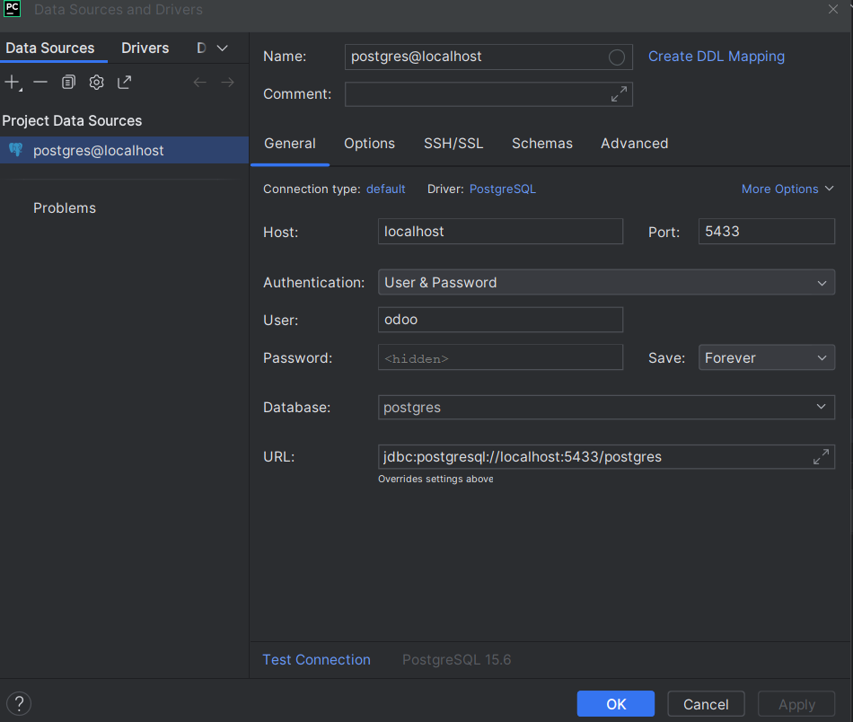
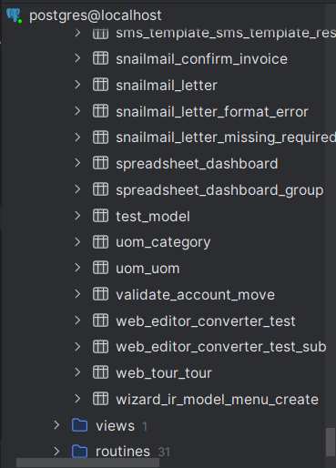

# Modulo-Odoo

## Odoo OpenAcademy

En este repositorio, explico como usar OpenAcademy en Odoo.
Open Academy es un módulo de Odoo el cual se utiliza para que las empresas creen cursos o sesiones de formación para los empleados y gestionar ciertos datos.

## Conexión a la base de datos

Primero mostrare el código el cual nos permitirá acceder a la base de datos para poder crear una propia.

```dockerfile
version: '3.1'
services:
  web:
    image: odoo:16.0
    depends_on:
      - mydb
    volumes:
      - ./extra-addons:/mnt/extra-addons
    ports:
      - "8069:8069"
    environment:
      - HOST=mydb
      - USER=odoo
      - PASSWORD=myodoo
  mydb:
    image: postgres:15
    environment:
      - POSTGRES_DB=postgres
      - POSTGRES_PASSWORD=myodoo
      - POSTGRES_USER=odoo
    ports:
      - "5433:5432"
```     
    

Recuerda utilizar el usuario, la contraseña y el puerto correcto para que la conexión con la base de datos se establezca. (Recuerda que en la sección donde creamos la database seleccionamos PostgresSQL)



Ahora ya podríamos ir a nuestro navegador y escribir en la barra superior localhost:8069 odoo nos permitirá crear nuestra base de datos.

## Instalar Módulo

Para poder instalar el módulo creamos en nuestro proyecto una carpeta llamada `extra-addons`

Ahora introduciremos los siguientes comandos en la terminal: 

+  docker exec -u root -it "nombre del proyecto"-web-1 /bin/bash: Con esto accederemos al contenedor de Odoo.

+ cd /mnt/extra-addons: Con este comando accedemos a la carpeta `extra-addons`.

+ odoo scaffold openacademy: Con este comando creamos la estructura y los archivos del módulo.

+ chmod -R 777 openacademy: Con este comando le damos todos los permisos a la carpeta del módulo

Ahora reiniciaremos el contendor para que todo los cambios se apliquen y deberíamos tener esta estructura.


## Configurar Módulo y creación de la tabla

Lo primero será instalar el módulo desde Odoo. Para ello primero tendremos que irnos a ajustes y activar el modo desarrollador para que podamos añadir el módulo. Después en el buscador buscaremos OpenAcademy y lo instalaremos. Una vez instalador podemos darle a mas información para ver los datos del módulo


Esa información es posible modificarla desde el archivo manifest.py que hay en nuestra estructura. Podremos cambiar el nombre, la descripción, la versión...


Ahora crearemos la tabla. Esto lo haremos en la carpeta `models` y modificaremos el archivo `models.py`. 
Este es el código que yo utilicé para crear la tabla.


```python
# -*- coding: utf-8 -*-

from odoo import fields, models

class TestModel(models.Model):
    _name = "test_model"
    _description = "Modelo de prueba"

    name = fields.Char(string="Nombre")
    description = fields.Text(string="Dirección")

```

Cuando hayamos modificado el archivo reiniciaremos el contenedor y actualizaremos la base de datos. También le daremos a actualizar en Odoo al módulo de OpenAcademy para que se apliquen todos los cambios. Después nos iremos a la base de datos y le daremos a `public --> tables` y debería aparecernos la tabla `test_model`.





Ahora introduciremos datos a nuestra tabla, para eso hay que realizar una carpeta la cual llamaremos `data` y en ella crearemos un archivo llamada `datos.xml` y escribiremos el siguiente código acorde con nuestro archivo models.py 


```xml
<odoo>
    <data>
        <record model="test_model" id="openacademy.nombres">
            <field name="name">Pepe</field> <!-- El nombre debe ser el mismo que la variable del modelo -->
            <field name="description">50</field> <!--El nombre debe ser el mismo que la variable del modelo-->
        </record>
    </data>
</odoo>
```

Una vez creado el archivo, lo añadimos al archivo 'manifest.py' en la sección de 'data'.

```xml
 <odoo>
    <data>
        <record model="test_model" id="openacademy.nombres">
            <field name="name">Pablo</field>
            <field name="description">Plaza España</field>
        </record>
    </data>
</odoo>

```

Una vez creemos el archivo xml lo añadiremos en nuestro achivo `_manifest_.py` en la sección de `data` y pondremos el nombre de nuestro archivo

```python 
 # always loaded
    'data': [
        'security/ir.model.access.csv',
        'views/views.xml',
        'views/templates.xml',
        'data/datos.xml'
    ],

```
Ahora reiniciaremos nuestro contenedor y actualizaremos nuestra base de datos para que los cambios se apliquen y ahora ya si que podríamos visualizar los datos que hemos introducido en nuestra tabla.


Por último tendremos que modificar dos archivos para que podamos visualizar la tabla en nuestro módulo desde Odoo.
Primero modificaremos nuestro archivo `views.xml` que se encuentra en la carpeta `views`. Este es el código que yo utilice en mi proyecto.

```xml
<odoo>
  <data>
    <!-- explicit list view definition -->
<!--
    <record model="ir.ui.view" id="openacademy.list">
      <field name="name">openacademy list</field>
      <field name="model">openacademy.openacademy</field>
      <field name="arch" type="xml">
        <tree>
          <field name="name"/>
          <field name="value"/>
          <field name="value2"/>
        </tree>
      </field>
    </record>
-->

    <!-- actions opening views on models -->

    <record model="ir.actions.act_window" id="openacademy.action_window">
      <field name="name">openacademy window</field>
      <field name="res_model">test_model</field>
      <field name="view_mode">tree,form</field>
    </record>


    <!-- server action to the one above -->
<!--
    <record model="ir.actions.server" id="openacademy.action_server">
      <field name="name">openacademy server</field>
      <field name="model_id" ref="model_openacademy_openacademy"/>
      <field name="state">code</field>
      <field name="code">
        action = {
          "type": "ir.actions.act_window",
          "view_mode": "tree,form",
          "res_model": model._name,
        }
      </field>
    </record>
-->

    <!-- Top menu item -->

    <menuitem name="openacademy" id="openacademy.menu_root"/>

    <!-- menu categories -->

    <menuitem name="Menu 1" id="openacademy.menu_1" parent="openacademy.menu_root"/>
    <menuitem name="Menu 2" id="openacademy.menu_2" parent="openacademy.menu_root"/>

    <!-- actions -->

    <menuitem name="List" id="openacademy.menu_1_list" parent="openacademy.menu_1"
              action="openacademy.action_window"/>
<!--
    <menuitem name="Server to list" id="openacademy" parent="openacademy.menu_2"
              action="openacademy.action_server"/>
-->
  </data>
</odoo>
```

Ahora no iremos al archivo `_manifest_.py` y descomentaremos el apartado que pone security para poder visualizar la tabla.


```python
 # always loaded
    'data': [
        'security/ir.model.access.csv',
        'views/views.xml',
        'views/templates.xml',
        'data/datos.xml'
    ],
```
Finalmente nos iremos a la carpeta `security` y modificaremos el archivo `ir.model.access.csv` Aqui modificaremos el nombre y el grupo al que pertenece.

```csv
id,name,model_id:id,group_id:id,perm_read,perm_write,perm_create,perm_unlink
access_openacademy_openacademy,openacademy.openacademy,model_test_model,base.group_user,1,1,1,1
```

Reiniciamos el contenedor y actualizamos la base de datos y nos iremos a Odoo. Actualizaremos el módulo OpenAcademy y deberia aparecernos al clicar en la esquina superiror izquierda.


<br>
<br>

Si quieres añadir datos puedes darle a `Nuevo` y escribir los datos que desees.


Cuando lo hayas agregado estos datos deberían registrarse en la tabla de nuestra base de datos y si hemos seguido todos los pasos correctamente debría mostrarnos los datos que hemos introducido.


Y hasta aqui la explicación, espero que os haya servido. 

Un saludo :D


